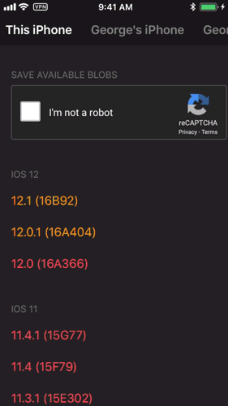

Blob Saver
 

===============

Blob Saver is a [TSSSaver](https://tsssaver.1conan.com) iOS client that remembers devices, auto-fills SHSH blob requests, and displays version timelines of collected, still-signing, and no-longer signing firmwares for each device.

Device data is stored locally by default, with optional iCloud synchronization support.

NOTE: Blob Saver does NOT currently support downloading SHSH Blobs to devices or iCloud. Please use TSSSaver to retrieve your SHSH Blobs. This feature will become available if there is high demand for it.

1. [Where Blob Saver excels](#where-blob-saver-excels)
1. [I'm new, why do I care?](#im-new-why-do-i-care)
1. [Installation](#installation)
1. [Limitations](#limitations)
1. [Future Ideas](#future-ideas)

# Where Blob Saver excels
Thanks to TSSSaver, saving SHSH Blobs for a device is as easy as filling out a web page - provided you remember and know how to get the required device data.

Blob Saver improves on TSSSaver in four aspects: version timeline UI, device data storage, automatic device detection, and SHSH Blob form auto-fill.

## Version timeline UI
Blob Saver displays a handy version timeline table for each device, so users can easily keep track of currently signed firmware and firmware that they have SHSH Blobs saved for. Firmware versions are color-coded where:
* Green -> SHSH Blob has been saved for the firmware.
* Orange -> SHSH Blob has not been saved yet, but Apple is still signing the firmware.
* Red -> SHSH Blob has not been saved, and Apple is no longer signing the firmware.

## Device Data Storage
Blob Saver can write to a device's local and (optional) iCloud storage so that devices only need to be set up once. iCloud storage access means users with multiple devices tied to the same iCloud account also only need to setup device info once. iCloud data synchronization is handled automatically by Blob Saver.

## Automatic device detection
One of the biggest advantages Blob Saver has to the TSSSaver web client is the ability for Blob Saver to read the current device info to make setup easier.

When setting up a new device, Blob Saver will automatically fetch and suggest the current device's **name, model, and board configuration** (if applicable).

NOTE: This is especially helpful for people with iPhone 6S, 6S+, and SE devices as well as iPad 5, where board configuration info is required and very tedious to get.

## SHSH Blob form auto-fill
Perhaps the most convenient feature of Blob Saver is auto-fill. All the form data on TSSSaver is abstracted from the user and auto-filled. The only input required by the user for Blob Saver is the Google ReCaptcha - there isn't even a need to press a submit button!

Blob Saver also intelligently enables the blob saving feature for a device only when it has detected that there is a firmware that Apple is still signing, but the user does not have SHSH Blobs for.

# I'm new, why do I care?
When a new software update goes live for some technology, it is **always** in the interest of the creator to have you update. After all, they didn't create the update just for laughs and giggles. Typically, the update would include some combination of security patches, bug fixes, UI / UX tweaks, or new features.

However, it is **usually** in the best interest of the user to actually follow through with the update. The new update **could** introduce new bugs, force new unwanted changes, modify or disable existing helpful features, brick your device (render it unusable), introduce microtransactions, or (apparently) even delete your entire [documents folder](https://www.techrepublic.com/article/windows-10-file-wiping-bug-what-happens-if-youre-affected/).

This mismatch of interests means **downgrading versions** is definitely a big "no-no" for users. Even if you legitimately have a problem with the latest update, or hate the new changes - you're usually out of luck. Companies like Apple even implement security measures to prevent downgrades.

Blob Saver is designed to help make downgrading to older firmwares on iOS and tvOS possible, by saving the digital signatures required by iTunes to restore a device to a particular firmware.

## How Apple prevents downgrades
Apple has its own digital signature protocol that dictates whether a user is eligible for a firmware restore. Every firmware restore requires a digital signature from Apple, known unofficially as a **[SHSH Blob](https://en.wikipedia.org/wiki/SHSH_blob)**. This is why, even if you have the correct official firmware files downloaded to your PC, iTunes will throw an error when you attempt a restore to a firmware older than the latest version.

## SHSH Blobs
These signatures are problematic because they are device-specific and firmware-specific. That means, every device has its own unique signature for restoring to a particular firmware. No two devices can share the same signature to restore, and no device can share the same signature to restore to two distinct firmwares.

However, signatures are not "consumed" - meaning the same signature is used to restore Device 1 to firmware A everytime. This is nice, because you only need to collect the signature for a version once, and you can always downgrade to that version in the future. Again, you need to collect the signature for each device you own.

## The signing window
Apple has one more trick up its sleeve. These signatures are not handed out forever. In fact, Apple only generates signatures for firmwares when they are the latest version. Once Apple releases a newer version, previous version restores will usually get rejected within a matter of weeks. The period of time Apple allows a version to be restored is known as the **signing window**, because Apple is "signing" firmware restore requests during that time.

## How do I start collecting SHSH Blobs?
As a normal Apple user you wouldn't be able to. The SHSH Blobs that Apple provides during a restore are meant for iTunes only, and are most definitely not meant to be saved. It's important to acknowledge that the jailbreak community has simply found a clever way to trick iTunes into generating the signature for a device when they are not truly requesting for a device restore. TSSSaver (and by extension Blob Saver) use [TSSChecker](https://github.com/tihmstar/tsschecker) to fetch and save SHSH Blobs automatically.

## Cool story, how does this benefit me?
If you're a fan of Jailbreaking, you will care a lot about saving SHSH Blobs for your device. The Jailbreaking process requires security vulnerabilities to work, which are much more easily found on older versions of iOS / tvOS than the latest firmware. Saving SHSH Blobs for every new version to release means that eventually, when a jailbreak comes out for any of the new firmwares, you can safely restore and jailbreak long after Apple has stopped signing that version.

Otherwise, it is a great way to increase the value of your device. Any device that has the ability to downgrade to older versions has more value than a device that can't downgrade.

# Installation
The source code is here. If you're a developer, you know the drill. Just make sure you have [Carthage](https://github.com/Carthage/Carthage) installed and do a `carthage update` in the root directory of the repo before building.

The recommended way to install Blob Saver is through the [TestFlight public invite](https://testflight.apple.com/join/yNwLIeBO). Just follow the instructions to install the app on your device. Please note that only the first 10000 users can install Blob Saver using TestFlight.

Unfortunately, this app will **NEVER** get approved by Apple so there is no point trying to submit to the App Store. These distribution methods are really all I got.

# Limitations
Blob Saver currently uses the TSSSaver website to submit SHSH Blob requests. TSSSaver uses Google ReCaptcha v2 to prevent users from spamming requests. This means that if you try to save SHSH Blobs for every device in quick succession from Blob Saver, Google ReCaptcha v2 will give increasingly difficult challenges for you to solve. I always solve the challenge using the audio option, because it is a lot faster than picture matching.

Using a VPN while completing the Google ReCaptcha also sometimes helps "reset" its difficulty and re-enable the audio option if it is not available. The best thing to do is wait a while before making another SHSH Blob save request to TSSSaver.

# Future Ideas
Blob Saver still has a lot of room to grow as the ultimate SHSH Blob saving client. For starters, the most useful feature would be the ability to save SHSH Blobs locally on device and iCloud so that it no longer relies on TSSSaver.

Other features I have planned include a push notification service to alert users when new versions of iOS / tvOS come out, and automatic refreshing for when new SHSH Blobs have been updated on TSSSaver's servers.

Finally, the ability to submit SHSH Blob requests for every device at once, without Google ReCaptcha.

Feel free to send other suggestions to me at anythingblobsaver@gmail.com. As stands, I am currently satisfied with Blob Saver enough to use it as a real user on all my devices. But I am open to implementing the above features if people come to find Blob Saver useful.
